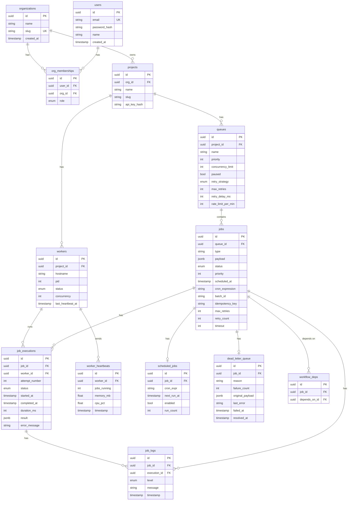

# JobFlow — Project Report

## Distributed Job Scheduling Platform

---

## Table of Contents

1. [Project Overview](#1-project-overview)
2. [System Architecture](#2-system-architecture)
3. [Database Design](#3-database-design)
4. [Backend Engineering](#4-backend-engineering)
5. [Reliability and Concurrency](#5-reliability-and-concurrency)
6. [Frontend and UX](#6-frontend-and-ux)
7. [API Design](#7-api-design)
8. [Design Decisions](#8-design-decisions)
9. [Testing](#9-testing)
10. [Setup Instructions](#10-setup-instructions)
11. [Source Code Reference](#11-source-code-reference)

---

## 1. Project Overview

JobFlow is a production-grade distributed job scheduling platform that reliably executes asynchronous background jobs across multiple workers. It implements multi-tenant authentication, configurable job queues, five job types (immediate, delayed, scheduled, recurring, batch), a worker service with atomic claiming and graceful shutdown, a complete job lifecycle with retry strategies and Dead Letter Queue support, and a real-time monitoring dashboard.

### Tech Stack

| Layer | Technology |
|---|---|
| API Server | Node.js, Fastify, TypeScript |
| Database | PostgreSQL 16 |
| Cache / Pub-Sub | Redis 7, IORedis |
| ORM | Prisma 5 |
| Auth | JWT, bcrypt |
| Validation | Zod |
| Logging | Pino |
| Frontend | React 19, Vite 8 |
| Charts | Recharts |
| Data Fetching | TanStack Query |
| Testing | Vitest |
| Containers | Docker, Docker Compose |

---

## 2. System Architecture

**Source:** [`docs/architecture.md`](docs/architecture.md)

### High-Level Component Diagram

```
┌─────────────────────────────────────────────────────────────┐
│                     React Dashboard                         │
│      Auth │ Queues │ Jobs │ Workers │ Metrics │ DLQ          │
└──────────────────────────┬──────────────────────────────────┘
                           │  HTTP REST + WebSocket
┌──────────────────────────▼──────────────────────────────────┐
│                   Fastify API Server                        │
│                                                             │
│  /api/auth     /api/projects    /api/queues    /api/jobs    │
│  /api/workers  /api/metrics     /api/dlq       /ws/events   │
│                                                             │
│  JWT Auth  │  Rate Limiting  │  Zod Validation  │  Pino     │
└──────┬──────────────────────────┬────────────────┬──────────┘
       │                          │                │
  ┌────▼────┐              ┌──────▼──────┐   ┌────▼──────────┐
  │  Redis  │              │ PostgreSQL  │   │  WebSocket    │
  │         │              │     16      │   │  (per-project │
  │ Pub/Sub │              │             │   │   rooms)      │
  │ Dist.   │              │ ACID Txns   │   └───────────────┘
  │ Lock    │              │ SKIP LOCKED │
  │ Rate    │              │ JSONB       │
  │ Limit   │              └──────┬──────┘
  └─────────┘                     │
                  ┌───────────────┼───────────────┐
                  │               │               │
           ┌──────▼──────┐ ┌─────▼───────┐ ┌─────▼───────┐
           │  Worker 1   │ │  Worker 2   │ │  Scheduler  │
           │             │ │             │ │             │
           │ poll → claim│ │ poll → claim│ │ cron scan   │
           │ execute     │ │ execute     │ │ (1 min)     │
           │ heartbeat   │ │ heartbeat   │ │ Redis lock  │
           │ retry / DLQ │ │ retry / DLQ │ └─────────────┘
           └─────────────┘ └─────────────┘
```

### Component Responsibilities

**API Server** — Stateless HTTP and WebSocket server built on Fastify. Handles all client requests, validates input with Zod schemas, and publishes job events to Redis for real-time dashboard updates.

**Worker Service** — Independent process that polls PostgreSQL for claimable jobs, executes them concurrently up to a configurable limit, sends heartbeats, handles retries, and routes permanently failed jobs to the Dead Letter Queue. Multiple worker instances can run in parallel with zero coordination overhead.

**Cron Scheduler** — Separate process that scans `scheduled_jobs` every minute. Acquires a Redis distributed lock before processing to prevent duplicate scheduling in multi-instance deployments. Each trigger creates a new job row, preserving complete execution history per cron run.

**PostgreSQL** — Single source of truth for all job state. Uses `SELECT FOR UPDATE SKIP LOCKED` for atomic job claiming, JSONB columns for flexible payloads, and composite indexes for efficient polling queries.

**Redis** — Provides distributed locking for the cron scheduler, pub/sub for broadcasting events to WebSocket clients across API instances, and backing storage for rate limiting. The system degrades gracefully if Redis is unavailable.

### Data Flow

```
Client submits job via POST /api/jobs
            │
            ▼
     ┌─────────────┐
     │   QUEUED     │  ← immediate jobs
     │  SCHEDULED   │  ← delayed / cron / future jobs
     └──────┬──────┘
            │  Worker polls (SELECT FOR UPDATE SKIP LOCKED)
            ▼
     ┌─────────────┐
     │   CLAIMED    │  ← job locked atomically to one worker
     └──────┬──────┘
            │  Worker begins execution
            ▼
     ┌─────────────┐
     │   RUNNING    │  ← heartbeats sent, logs streamed
     └──────┬──────┘
           / \
          /   \
     success   failure
        │         │
        ▼         ▼
  ┌──────────┐  ┌────────┐
  │COMPLETED │  │ FAILED │ → retry delay calculated → re-QUEUED
  └──────────┘  └────┬───┘
                     │  retries exhausted
                     ▼
                ┌────────┐
                │  DEAD  │ → Dead Letter Queue entry created
                └────────┘
```

### Scaling Strategy

| Component | Strategy |
|---|---|
| API Server | Stateless; scale horizontally behind a load balancer |
| Workers | Horizontal scaling; SKIP LOCKED handles contention |
| Scheduler | Single active instance via Redis distributed lock |
| PostgreSQL | Vertical scaling; read replicas for analytics queries |
| Redis | Single node; Sentinel or Cluster for high availability |

---

## 3. Database Design

**Source:** [`docs/er-diagram.md`](docs/er-diagram.md) | [`backend/prisma/schema.prisma`](backend/prisma/schema.prisma)

### Entity-Relationship Diagram



### Schema Summary

The schema consists of 15 normalised tables with full referential integrity.

| Table | Purpose |
|---|---|
| `users` | User accounts with bcrypt-hashed passwords |
| `organizations` | Multi-tenant root entity with unique slug |
| `org_memberships` | Role-based access: Owner, Admin, Member |
| `projects` | Isolation boundary; stores bcrypt-hashed API keys |
| `queues` | Job queues with embedded retry policy, concurrency limits, and optional rate limiting |
| `jobs` | Central table with JSONB payload, status machine, idempotency key, and cron expression |
| `job_executions` | One row per attempt; records timing, result, and full error stack |
| `workers` | Self-registered worker processes with heartbeat tracking |
| `worker_heartbeats` | Time-series telemetry: memory, CPU, active job count |
| `job_logs` | Append-only structured log entries per execution |
| `scheduled_jobs` | Cron template linking to a source job with next_run_at tracking |
| `dead_letter_queue` | Permanent failure records with requeue and resolve workflows |
| `workflow_deps` | DAG edges for job dependency ordering |

### Index Strategy

| Table | Index | Purpose |
|---|---|---|
| `jobs` | `(queue_id, status, scheduled_at)` | Worker claim query — the critical hot path |
| `jobs` | `(status, scheduled_at)` | Scheduled job promotion |
| `jobs` | `(batch_id)` | Batch job lookups |
| `job_executions` | `(job_id)` | Execution history per job |
| `job_executions` | `(worker_id)` | Active jobs per worker |
| `job_logs` | `(job_id, timestamp)` | Log streaming |
| `worker_heartbeats` | `(worker_id, timestamp)` | Latest heartbeat lookup |
| `scheduled_jobs` | `(enabled, next_run_at)` | Cron scanner query |
| `dead_letter_queue` | `(queue_id, failed_at)` | DLQ listing |

### Key Design Choices

- **Cascading deletes** from Project through Queues, Jobs, Executions, and Logs. Deleting a project cleanly removes all associated data.
- **JSONB payload** on the jobs table allows flexible, schema-less job data while remaining queryable with PostgreSQL's JSON operators.
- **Unique constraint on `(queue_id, idempotency_key)`** enforces at-most-once semantics at the database level.
- **Composite index `(queue_id, status, scheduled_at)`** is specifically designed for the worker's claim query, which filters by queue, status = QUEUED, and scheduled_at <= now().

---

## 4. Backend Engineering

**Source:** [`backend/src/`](backend/src/)

### API Server

The backend is built on Fastify with TypeScript. The server bootstraps in [`server.ts`](backend/src/server.ts), registering plugins and route handlers:

- **Authentication** — JWT-based stateless auth with 7-day token expiry. API keys (bcrypt-hashed) for programmatic access. Middleware in [`middleware/auth.ts`](backend/src/middleware/auth.ts).
- **Input validation** — All request bodies and query parameters are validated using Zod schemas before reaching route handlers. Invalid requests receive structured error responses.
- **Error handling** — Centralised error handler in [`middleware/errorHandler.ts`](backend/src/middleware/errorHandler.ts) maps Zod validation errors, Prisma constraint violations, and application errors to consistent JSON responses.
- **Rate limiting** — `@fastify/rate-limit` backed by Redis for distributed rate limiting across API instances.
- **Structured logging** — Pino logger configured in [`utils/logger.ts`](backend/src/utils/logger.ts) with JSON output in production and pretty-printing in development.

### Route Handlers

| Route File | Endpoints | Key Operations |
|---|---|---|
| [`auth.ts`](backend/src/routes/auth.ts) | register, login, me | Password hashing, JWT signing, org creation |
| [`projects.ts`](backend/src/routes/projects.ts) | CRUD, rotate-key | API key generation, bcrypt hashing |
| [`queues.ts`](backend/src/routes/queues.ts) | CRUD, pause, resume, stats | Live job count aggregation, time-series stats |
| [`jobs.ts`](backend/src/routes/jobs.ts) | create, batch, list, cancel, retry | All five job types, idempotency enforcement, pagination |
| [`workers.ts`](backend/src/routes/workers.ts) | register, heartbeat, list | Auto-offline detection (>30s without heartbeat) |
| [`metrics.ts`](backend/src/routes/metrics.ts) | throughput, system health | Time-bucketed aggregation, queue breakdown |
| [`dlq.ts`](backend/src/routes/dlq.ts) | list, requeue, resolve | Re-queue workflow, resolution tracking |
| [`websocket.ts`](backend/src/routes/websocket.ts) | WS events | Per-project rooms, Redis pub/sub bridge |

### Worker Service

The worker in [`worker/runner.ts`](backend/src/worker/runner.ts) implements the following loop:

1. **Poll** — Every `WORKER_POLL_INTERVAL_MS` (default 1 second), query for claimable jobs.
2. **Claim** — Execute `SELECT ... FOR UPDATE SKIP LOCKED` to atomically transition a job from QUEUED to CLAIMED.
3. **Execute** — Run the job handler concurrently (non-blocking), up to `WORKER_CONCURRENCY` limit.
4. **Heartbeat** — Every 10 seconds, update `last_heartbeat_at` and create a `WorkerHeartbeat` record with memory and CPU telemetry.
5. **Retry/DLQ** — On failure, calculate next retry delay based on the queue's strategy. If retries are exhausted, mark the job DEAD and create a Dead Letter Queue entry.

### Cron Scheduler

The scheduler in [`worker/scheduler.ts`](backend/src/worker/scheduler.ts):

1. Acquires a Redis distributed lock (`SET key NX PX 55000`) to ensure single-instance execution.
2. Scans `scheduled_jobs` where `enabled = true` and `next_run_at <= now()`.
3. For each due cron, clones the template job into a new `jobs` row.
4. Updates `next_run_at` to the next cron trigger time.
5. Releases the lock.

---

## 5. Reliability and Concurrency

### Atomic Job Claiming

The worker uses raw SQL to claim jobs:

```sql
UPDATE jobs SET status = 'CLAIMED', updated_at = NOW()
WHERE id = (
  SELECT id FROM jobs
  WHERE queue_id = $1
    AND status = 'QUEUED'
    AND scheduled_at <= NOW()
  ORDER BY priority DESC, created_at ASC
  FOR UPDATE SKIP LOCKED
  LIMIT 1
)
RETURNING *
```

`FOR UPDATE SKIP LOCKED` is the key mechanism. It acquires a row-level lock on the selected job and skips any rows already locked by other transactions. This guarantees:

- No two workers can claim the same job.
- Workers never block each other — if a row is locked, the next available row is selected.
- No external coordination (Zookeeper, etcd) is required.

### Retry Engine

Retry delays are calculated in [`utils/retry.ts`](backend/src/utils/retry.ts):

| Strategy | Formula |
|---|---|
| Fixed | `retryDelayMs` |
| Linear | `retryDelayMs × attemptNumber` |
| Exponential | `retryDelayMs × multiplier^(attempt - 1)`, capped at `retryMaxDelayMs` |

All strategies apply ±10% random jitter to prevent synchronised retry storms when a downstream service outage causes many jobs to fail simultaneously.

### Graceful Shutdown

On SIGTERM or SIGINT:

1. Stop accepting new jobs (set `running = false`).
2. Wait up to 60 seconds for active jobs to complete.
3. Mark the worker as OFFLINE.
4. Close database and Redis connections.
5. Exit.

### Dead Letter Queue

When `retryCount >= maxRetries`, the job transitions to DEAD and a `dead_letter_queue` entry is created with the original payload, failure reason, error stack trace, and attempt count. These entries can be re-queued or marked resolved from the API or dashboard.

### Distributed Locking

The cron scheduler uses Redis `SET key NX PX 55000` to acquire a lock before processing. This ensures that even if multiple scheduler instances are running (e.g., in a multi-container deployment), only one processes cron jobs at any given time. The lock automatically expires after 55 seconds, preventing deadlocks if the holder crashes.

### Heartbeat-Based Health Detection

Workers send heartbeats every 10 seconds. The API automatically marks workers as OFFLINE if no heartbeat has been received in the last 30 seconds. This handles crash detection without requiring explicit deregistration.

---

## 6. Frontend and UX

**Source:** [`frontend/src/`](frontend/src/)

The frontend is a React 19 single-page application built with Vite 8 and TypeScript. It uses a custom dark-mode design system defined in [`index.css`](frontend/src/index.css) with CSS custom properties, glassmorphism effects, and smooth animations.

### Pages

| Page | File | Description |
|---|---|---|
| Login / Register | [`LoginPage.tsx`](frontend/src/pages/LoginPage.tsx) | Tabbed auth form with demo credentials |
| Dashboard | [`DashboardPage.tsx`](frontend/src/pages/DashboardPage.tsx) | Summary stat cards, throughput area chart, queue depth bar chart, queue health table |
| Queues | [`QueuesPage.tsx`](frontend/src/pages/QueuesPage.tsx) | Queue cards with live counters, create/edit modal, pause/resume controls |
| Jobs | [`JobsPage.tsx`](frontend/src/pages/JobsPage.tsx) | Filterable job table with pagination, detail drawer (executions, logs, errors), create job modal supporting all four scheduling modes |
| Workers | [`WorkersPage.tsx`](frontend/src/pages/WorkersPage.tsx) | Worker cards with status indicators, memory/CPU progress bars, heartbeat timestamps |
| Metrics | [`MetricsPage.tsx`](frontend/src/pages/MetricsPage.tsx) | Throughput line chart, status distribution donut chart, per-queue bar chart, configurable time ranges |
| Dead Letter Queue | [`DLQPage.tsx`](frontend/src/pages/DLQPage.tsx) | Failed job list with error details, re-queue and resolve actions, expandable stack traces |

### Key Frontend Features

- **Real-time updates** — WebSocket connection via [`useWebSocket.ts`](frontend/src/hooks/useWebSocket.ts) with auto-reconnection and 30-second keep-alive pings.
- **Optimistic UI** — TanStack Query with automatic cache invalidation on mutations.
- **Project context** — Project selector in the sidebar scopes all data to the active project.
- **Toast notifications** — Global notification system for action confirmations and errors.
- **Responsive data fetching** — Configurable polling intervals per page, with WebSocket events triggering immediate refetches.

---

## 7. API Design

**Source:** [`docs/api-reference.md`](docs/api-reference.md)

### Design Principles

- **RESTful resource naming** — `/api/queues`, `/api/jobs`, `/api/workers`.
- **Consistent error format** — All errors return `{ statusCode, error, message, details }`.
- **Pagination** — All list endpoints support `page` and `limit` query parameters, returning `{ data, pagination: { page, limit, total, pages } }`.
- **Filtering** — Jobs can be filtered by `status`, `queueId`, `type`, `batchId`, and date range.
- **Idempotency** — `POST /api/jobs` accepts an optional `idempotencyKey` to prevent duplicate job creation. Collisions return 409 Conflict.

### Endpoint Summary

| Method | Path | Description |
|---|---|---|
| POST | `/api/auth/register` | Create user and organisation |
| POST | `/api/auth/login` | Authenticate, returns JWT |
| GET | `/api/auth/me` | Current user profile and memberships |
| GET | `/api/projects` | List accessible projects |
| POST | `/api/projects` | Create project (returns API key once) |
| POST | `/api/projects/:id/rotate-key` | Rotate project API key |
| DELETE | `/api/projects/:id` | Delete project (cascades) |
| GET | `/api/queues` | List queues with live counters |
| POST | `/api/queues` | Create queue with retry policy |
| PATCH | `/api/queues/:id` | Update queue configuration |
| POST | `/api/queues/:id/pause` | Pause queue |
| POST | `/api/queues/:id/resume` | Resume queue |
| GET | `/api/queues/:id/stats` | Time-series execution statistics |
| DELETE | `/api/queues/:id` | Delete queue (cascades) |
| POST | `/api/jobs` | Create job (immediate, delayed, scheduled, cron) |
| POST | `/api/jobs/batch` | Create up to 1,000 jobs atomically |
| GET | `/api/jobs` | List and filter jobs with pagination |
| GET | `/api/jobs/:id` | Full job detail with executions, logs, dependencies |
| POST | `/api/jobs/:id/cancel` | Cancel queued or scheduled job |
| POST | `/api/jobs/:id/retry` | Re-queue failed, dead, or cancelled job |
| GET | `/api/jobs/:id/logs` | Execution logs for a job |
| POST | `/api/workers/register` | Register worker process |
| POST | `/api/workers/:id/heartbeat` | Send heartbeat with telemetry |
| GET | `/api/workers` | List workers with status |
| POST | `/api/workers/:id/deregister` | Mark worker offline |
| GET | `/api/metrics` | Throughput, success rate, queue breakdown |
| GET | `/api/metrics/system` | System health: workers, DLQ count |
| GET | `/api/dlq` | List Dead Letter Queue entries |
| POST | `/api/dlq/:id/requeue` | Re-queue a dead job |
| POST | `/api/dlq/:id/resolve` | Mark DLQ entry as resolved |
| WS | `/ws/events?projectId=` | Real-time job and worker events |

### HTTP Status Codes

| Code | Usage |
|---|---|
| 200 | Successful read or update |
| 201 | Resource created |
| 400 | Validation error (includes field-level details) |
| 401 | Missing or invalid authentication |
| 403 | Insufficient permissions |
| 404 | Resource not found |
| 409 | Conflict (idempotency key collision, queue paused) |
| 429 | Rate limit exceeded |
| 500 | Internal server error |

---

## 8. Design Decisions

**Source:** [`docs/design-decisions.md`](docs/design-decisions.md)

### 1. SELECT FOR UPDATE SKIP LOCKED for Atomic Job Claiming

**Alternatives considered:**
- Redis-based queue (BullMQ): Adds Redis as a single point of failure for job durability. Loses ACID guarantees.
- Optimistic locking (compare-and-swap on status): Leads to retry storms under high contention.

**Decision:** Use PostgreSQL's `SELECT FOR UPDATE SKIP LOCKED`. It atomically locks and claims exactly one job per worker per poll, automatically skips locked rows without blocking, requires zero coordination between workers, and keeps jobs in a durable, queryable store.

**Trade-off:** PostgreSQL becomes the job broker. At very high throughput (>10K jobs/sec), a hybrid approach with Redis as a fast lane and PostgreSQL as durable storage would be more appropriate.

### 2. Separate Worker and Scheduler Processes

**Decision:** The worker (job execution) and scheduler (cron processing) run as independent processes.

**Rationale:** A slow cron scan does not block job execution. The scheduler can be a single instance (protected by a distributed lock) while workers scale horizontally. Each component can be monitored and scaled independently.

### 3. Retry with Jitter

**Decision:** All retry delays include ±10% random jitter.

**Rationale:** Prevents the thundering herd problem where all failed jobs retry simultaneously. This is critical for the exponential backoff strategy during downstream service outages.

### 4. Dead Letter Queue as a First-Class Entity

**Decision:** The DLQ is a dedicated database table with requeue and resolve workflows exposed through the API and dashboard.

**Rationale:** Permanently failed jobs must not be silently dropped. Operators need visibility into failure patterns, and one-click requeue from the dashboard enables fast recovery.

### 5. Redis as Optional Infrastructure

**Decision:** The system degrades gracefully without Redis.

**Fallback behaviour:**
- Rate limiting: Disabled.
- WebSocket events: Direct broadcast (single API instance only).
- Cron locking: Disabled (risk of duplicate scheduling in multi-scheduler setups).

**Rationale:** Reduces the barrier to local development. Teams can get started with only PostgreSQL.

### 6. JWT + Project-Scoped API Keys

**Decision:** Dashboard uses JWT for session management. Programmatic access uses project-scoped API keys.

**Rationale:** JWT is stateless and scales horizontally. API keys are bcrypt-hashed in the database; even a full database breach does not expose them. Keys are project-scoped, so a compromised key is isolated to a single project.

### 7. Cron as Template Jobs

**Decision:** A recurring job is stored as a template job paired with a `scheduled_jobs` row. Each trigger creates a new job row by cloning the template.

**Rationale:** Full execution history for every cron trigger. Each run can be individually inspected, retried, and logged. Schedule changes do not affect in-flight runs.

**Trade-off:** More rows in the jobs table over time. Mitigated with archival or TTL-based deletion for completed jobs.

### 8. Idempotency Keys

**Decision:** Optional per-queue idempotency keys with a unique database constraint.

**Rationale:** When a client submits a job and the network fails before receiving the response, the client may retry. Without an idempotency key, the job executes twice. With one, the second submission is rejected with 409 Conflict. The unique index `(queue_id, idempotency_key)` enforces this at the database level with zero application complexity.

### 9. Heartbeat-Based Worker Health

**Decision:** Workers are automatically marked OFFLINE if no heartbeat is received within 30 seconds.

**Rationale:** Workers do not need to explicitly deregister on crash. The system automatically detects stale workers and can surface them in the dashboard.

### 10. Multi-Tenant Isolation

**Decision:** Full tenant isolation through the hierarchy: Organisation → Project → Queue → Job.

**Rationale:** Workers can be scoped to specific projects or queues. API keys are project-scoped. Data never leaks across tenants.

---

## 9. Testing

**Source:** [`backend/tests/`](backend/tests/)

### Test Results

```
 ✓ tests/jobs.test.ts   (6 tests)
 ✓ tests/retry.test.ts  (7 tests)

 Test Files  2 passed (2)
 Tests      13 passed (13)
```

### Test Coverage

#### Retry Strategy Tests ([`retry.test.ts`](backend/tests/retry.test.ts))

| Test | Validates |
|---|---|
| Fixed delay calculation | Returns constant `retryDelayMs` regardless of attempt number |
| Linear delay calculation | Returns `retryDelayMs × attemptNumber` |
| Exponential delay calculation | Returns `retryDelayMs × multiplier^(attempt-1)` |
| Exponential delay capping | Delay does not exceed `retryMaxDelayMs` |
| Jitter application | Computed delay falls within ±10% of the base delay |
| Valid cron expressions | Accepts standard 5-field cron expressions |
| Invalid cron expressions | Rejects malformed cron strings |

#### Job Lifecycle Tests ([`jobs.test.ts`](backend/tests/jobs.test.ts))

| Test | Validates |
|---|---|
| Initial job status | Jobs are created with status QUEUED and retryCount 0 |
| Status transitions | QUEUED → CLAIMED → RUNNING → COMPLETED is a valid path |
| Failed job retry | FAILED status increments retryCount and re-schedules when under max |
| DLQ routing | Jobs with retryCount >= maxRetries transition to DEAD |
| Cancelled job state | CANCELLED jobs retain their original payload and metadata |
| Completed job immutability | COMPLETED jobs cannot transition to any other status |

### Running Tests

```bash
cd backend
npm test          # single run
npm run test:watch  # watch mode
```

---

## 10. Setup Instructions

### Prerequisites

- Node.js 20+
- PostgreSQL 16
- Redis 7 (optional)
- Docker and Docker Compose (for containerised setup)

### Docker (Recommended)

```bash
# Start all services
docker compose up -d

# Seed demo data (after ~30 seconds)
docker exec jobflow-api sh -c "npx prisma migrate deploy && npm run db:seed"

# Open dashboard
# http://localhost:5173
# Login: demo@jobflow.dev / password123
```

### Local Development

```bash
# Start infrastructure
docker run -d --name jf-postgres \
  -e POSTGRES_USER=jobflow -e POSTGRES_PASSWORD=jobflow -e POSTGRES_DB=jobflow \
  -p 5432:5432 postgres:16-alpine

docker run -d --name jf-redis -p 6379:6379 redis:7-alpine

# Terminal 1: API Server
cd backend
npm install
npx prisma db push
npm run db:seed
npm run dev

# Terminal 2: Worker
cd backend && npm run worker

# Terminal 3: Scheduler
cd backend && npm run scheduler

# Terminal 4: Frontend
cd frontend
npm install
npm run dev
```

### Environment Variables

| Variable | Required | Default |
|---|---|---|
| `DATABASE_URL` | Yes | — |
| `JWT_SECRET` | Yes | — |
| `REDIS_URL` | No | `redis://localhost:6379` |
| `PORT` | No | `3001` |
| `WORKER_CONCURRENCY` | No | `5` |
| `WORKER_POLL_INTERVAL_MS` | No | `1000` |
| `WORKER_HEARTBEAT_INTERVAL_MS` | No | `10000` |

---

## 11. Source Code Reference

| Deliverable | Location |
|---|---|
| Source code | [`backend/src/`](backend/src/), [`frontend/src/`](frontend/src/) |
| Setup instructions | [`README.md`](README.md), Section 10 above |
| Architecture diagram | [`docs/architecture.md`](docs/architecture.md), Section 2 above |
| ER diagram | [`docs/er-diagram.md`](docs/er-diagram.md), Section 3 above |
| API documentation | [`docs/api-reference.md`](docs/api-reference.md), Section 7 above |
| Design decisions | [`docs/design-decisions.md`](docs/design-decisions.md), Section 8 above |
| Automated tests | [`backend/tests/`](backend/tests/), Section 9 above |
| Database schema | [`backend/prisma/schema.prisma`](backend/prisma/schema.prisma) |
| Docker setup | [`docker-compose.yml`](docker-compose.yml) |
| Worker service | [`backend/src/worker/runner.ts`](backend/src/worker/runner.ts) |
| Cron scheduler | [`backend/src/worker/scheduler.ts`](backend/src/worker/scheduler.ts) |

---

## Evaluation Criteria Mapping

| Criterion | Marks | Implementation |
|---|---|---|
| System Architecture | 20 | Multi-tenant, horizontally scalable workers, separate scheduler process, WebSocket pub/sub, Redis distributed locking, stateless API |
| Database Design | 20 | 15 normalised tables, SKIP LOCKED claiming, composite indexes, cascading deletes, JSONB payloads, idempotency constraints |
| Backend Engineering | 20 | Fastify REST API, JWT + API key auth, Zod validation, structured error handling, Pino logging, rate limiting, pagination, filtering |
| Reliability and Concurrency | 15 | Atomic claiming (SKIP LOCKED), three retry strategies with jitter, Dead Letter Queue, graceful shutdown, heartbeat health detection, distributed cron lock |
| Frontend and UX | 10 | Dark-mode dashboard, live charts (Recharts), WebSocket real-time updates, job detail drawer, queue management, toast notifications |
| API Design | 5 | RESTful endpoints, consistent error format, pagination, filtering, idempotency keys, WebSocket events, structured status codes |
| Documentation | 5 | Architecture diagram, ER diagram, API reference, design decisions document, README with setup instructions |
| Testing | 5 | 13 automated tests covering retry strategies, cron validation, job lifecycle transitions, DLQ routing |
