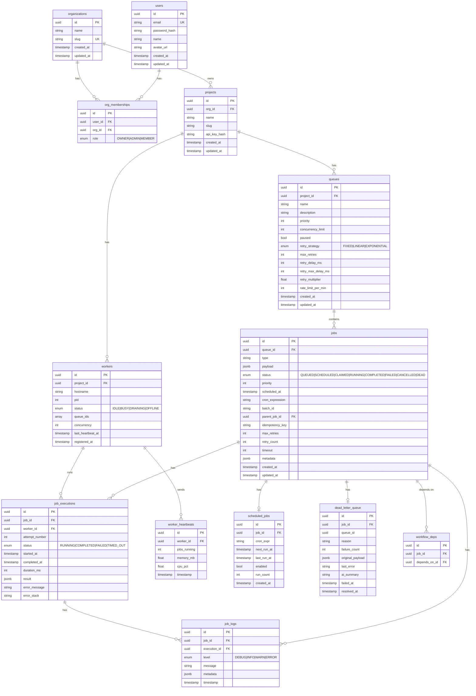

# JobFlow — Entity-Relationship Diagram

## Full ER Diagram

---

## Table Descriptions

### `users`
Core user accounts. Supports multiple organization memberships.

### `organizations`
Multi-tenant root entity. Multiple users can belong to one org.

### `org_memberships`
Junction table with role-based access control (OWNER > ADMIN > MEMBER).

### `projects`
A project belongs to an org and is the unit of isolation for queues and workers. API keys are hashed with bcrypt.

### `queues`
Configurable job queues with:
- **Concurrency limit**: max simultaneous workers per queue
- **Retry policy**: embedded on the queue (Fixed/Linear/Exponential + delay params)
- **Rate limit**: optional cap on job starts per minute
- **Pause/Resume**: `paused = true` prevents workers from claiming any jobs

### `jobs`
The central table. Key design decisions:
- **Status machine**: QUEUED → SCHEDULED/CLAIMED → RUNNING → COMPLETED/FAILED → DEAD
- **`idempotency_key`**: unique per queue, allows at-most-once semantics for duplicate submissions
- **`scheduled_at`**: used by both delayed jobs and retried jobs
- **JSONB payload**: flexible, indexable with GIN indexes if needed
- **Composite index on `(queue_id, status, scheduled_at)`**: critical for the claim query

### `job_executions`
One row per attempt. Preserves full history of all attempts, including timing and errors.

### `workers`
Self-registered worker instances. Marked OFFLINE automatically when heartbeat lapses >30s.

### `worker_heartbeats`
Time-series table of worker telemetry. Use for CPU/memory trending.

### `job_logs`
Append-only log entries per job/execution. Can be partitioned by month at scale.

### `scheduled_jobs`
Template for recurring cron jobs. Points to a "template" job; the scheduler clones it each run.

### `dead_letter_queue`
Permanent failure record. Includes `ai_summary` field for optional AI-generated failure analysis.

### `workflow_deps`
Stores DAG edges for workflow dependencies (job B cannot start until job A completes).

---

## Index Strategy

| Table | Index | Purpose |
|---|---|---|
| jobs | `(queue_id, status, scheduled_at)` | Efficient job claiming query |
| jobs | `(status, scheduled_at)` | Scheduled job promotion |
| jobs | `(batch_id)` | Batch job lookups |
| job_executions | `(job_id)` | Fetch executions for a job |
| job_executions | `(worker_id)` | Running jobs per worker |
| job_logs | `(job_id, timestamp)` | Log streaming |
| worker_heartbeats | `(worker_id, timestamp)` | Latest heartbeat query |
| scheduled_jobs | `(enabled, next_run_at)` | Due cron scanner |
| dead_letter_queue | `(queue_id, failed_at)` | DLQ listing |
